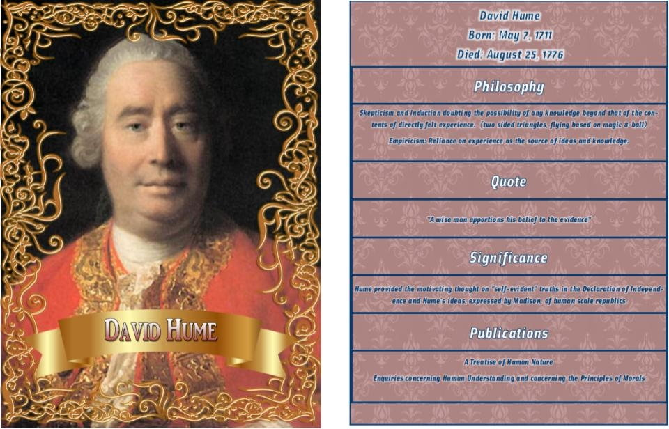

A History project. A heavily modified version of [thing](https://finalboss.org/public/thing/) from the depths of [finalboss.org](https://finalboss.org/). I would like to extend a big thank you to the Final Boss of the Internet for the basis for this project, and for just being a great place in general.

---

# [Enlightenment Trading Cards](https://grosserly.github.io/trading-cards/)
## The Age of Enlightenment
During the age of Enlightenment, most of the basic ideas that inspired future revolutions were introduced, debated, and discussed.  The Age of Enlightenment is also called the Age of Reason.  Many of the philosophers you will investigate during this activity will be used as inspiration for the American, French, and Latin American Revolutions.  

## Directions
Your group will create a collector’s set of trading cards based on the Enlightenment thinkers listed later in this document.  Working with a group, you will research the thinkers and create a collaborative collection (one where you share your work with your group) of your uniquely created deck.
1. Divide the thinkers equally among your group
2. Each person is responsible for researching the thinkers assigned to them
3. Create a common theme or template.
4. Within the groups, the only topic of conversation should be about the thinkers and the assignment
5. Each group will receive a group grade that will indicate not only completion of the task, but it will also contain an element dedicated to how well you were on task and worked together as a group.

## Card Requirements
### FRONT
- Creatively and clearly display their first and last name.
- Include a clear picture or portrait of the person
- Design the white space in a manner that the it is creative and artistic, but the focus remains on the name and picture.
### BACK
- Name/DOB/DOD- Include the thinker’s name, date of birth, and date of death.
- The “Statistics” portion of the card should be divided into 4 parts
- What were the thinkers’ main ideas or philosophies? Must list at least two.
- Quote - Write one quote from the thinkers that expresses and supports their beliefs.
- Significance - Why does this person still matter?  How did their ideas benefit or contribute to society? How do those ideas influence today?
- Publications - Provide a list of their published works. Make sure those publications are on the topic of Enlightenment thought. You can limit your list to a maximum of three.

## Thinkers
- John Locke
- Jean Jacques Rousseau
- Thomas Hobbes
- Adam Smith
- Voltaire
- Diderot
- Francis Bacon
- Descartes
- Baron de Montesquieu
- Sir Isaac Newton
- Immanuel Kant
- Benjamin Franklin

## Resources to assist you (you may and should use other sources)
- [History of Enlightenment](https://www.history.com/topics/british-history/enlightenment)
- [Age of Enlightenment Facts](https://kids.kiddle.co/Age_of_Enlightenment)
- [Famous People of the Enlightenment](https://www.biographyonline.net/people/famous/enlightenment.html)
- [Political Theory of the Enlightenment](https://plato.stanford.edu/entries/enlightenment/#PolThe) (Look for part 2.1)
- [Enlightenment in Colonial America](https://www.khanacademy.org/humanities/us-history/colonial-america/colonial-north-america/a/the-enlightenment)
- [Enlightenment Quotes](https://www.huffingtonpost.com/2014/02/21/enlightenment-spiritual-quotes_n_4817902.html?slideshow=true#gallery/338221/17)
- [Key Enlightenment Thinkers](https://www.thoughtco.com/key-thinkers-of-the-enlightenment-1221868)
- [Enlightenment Thinkers and Government](http://www.lcboe.net/userfiles/141/Classes/2439/enltthinkers.pdf%3Fid%3D537902)

## Example: David Hume

## Rubric
### FRONT SIDE
| Category | Points |
| -------- | -----------|
| Name is clearly visible and spelled correctly | 5 |
| Picture or Portrait is accurate and clear | 5 |
| Front side is decorated cleanly and creatively | 5 |

### BACK SIDE
| Category | Points |
| --- | --- |
| Name, DOB, and DOD are accurate and clearly visible | 5
| Thinkers main ideas and philosophies are clearly stated and include two examples | 5
| Quote applies to Enlightenment thought and philosophy | 5
| The significance of the thinker is expressed clearly as it pertains to American government | 5
| Publications are listed accurately and relate to subject matter | 5
| Back of card divided in a way that the reader can comprehend organization and meaning of each part | 5
| Back of card is organized cleanly and creatively | 5

### OVERALL
| Category | Points |
| --- | --- |
| Group stayed on task in class throughout the assignment | 5  
| All twelve cards are included in a single source and has been turned in individually by each member in Google Classroom | 5

| Total Points |   /60 |
| --- | --- |

## Credit

| Group Member's Name | Names of thinkers this person is responsible for researching | | |
| --- | --- | --- | --- |
| JH | Adam Smith | Thomas Hobbes | Diderot |
| KA | John Locke | Sir Isaac Newton | Voltaire |
| AB | Benjamin Franklin | Francis Bacon | Baron de Montesquieu |
| garlicOS® | Jean-Jacques Rousseau | Immanuel Kant | René Descartes |
